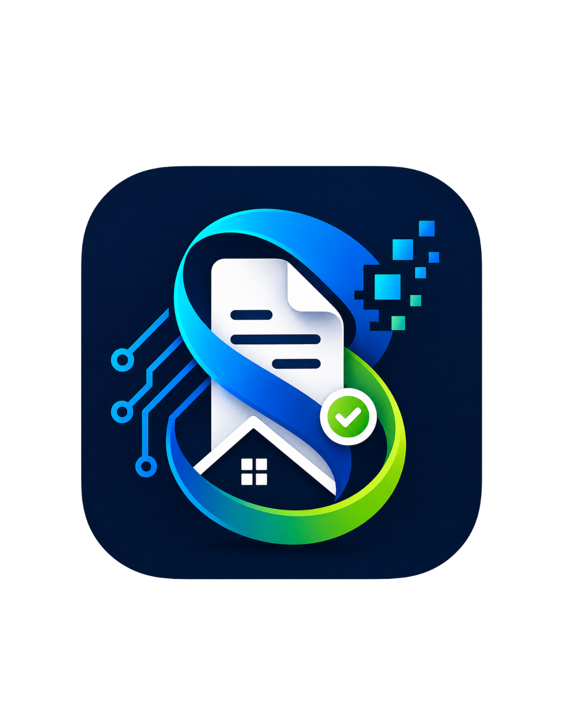

<p align="center">
  
</p>

<h1 align="center">SIPRAGA</h1>
<p align="center">Sistem Informasi Pelayanan Surat RT/RW Digital</p>

<p align="center">
  <a href="https://capstone-sipraga-v2.vercel.app"><strong>→ Buka Aplikasi</strong></a>
</p>

<p align="center">
  
  
  
  
</p>

---

## Demo

**URL:** [https://capstone-sipraga-v2.vercel.app](https://capstone-sipraga-v2.vercel.app)

| Role | Login | Kata Sandi |
|------|-------|------------|
| 👤 Warga | NIK: `1234567890123456` | `123456789` |
| 🏘️ RT | `tomsuri` | `initomsuri` |
| 🏡 RW | `KADES` | `inikades` |
| 🛡️ Superadmin | `sudmin` | `sudmin` |

> Akun demo bersifat shared — jangan mengubah kata sandi atau menghapus data.

---

## Fitur

| Role | Fitur |
|------|-------|
| **Warga** | Ajukan surat via wizard, tracking status real-time, unduh PDF |
| **RT / RW** | Verifikasi surat, tanda tangan digital, tolak / minta revisi |
| **Superadmin** | Manajemen akun RT/RW, template surat Markdown, konfigurasi instansi, log sistem |

**10 jenis surat tersedia:** Domisili · Tidak Mampu · KTP · KK · Nikah · Usaha · Kehilangan · SKCK · Ahli Waris · Beda Alamat

Setiap surat dilengkapi **live preview PDF**, **tanda tangan digital**, dan **QR verifikasi** tanpa login.

---

## Tech Stack

**Frontend** — React 19, Vite, Tailwind CSS 4, TanStack Query, React Hook Form

**Backend** — Node.js 18, Express 5, MySQL 8, JWT, Supabase Storage, BullMQ + Redis, Puppeteer

---

## Struktur Proyek

```
capstone_RT-RW_CORETAX/
├── backend/
│   └── src/
│       ├── config/          # DB, Redis, Supabase, Swagger
│       ├── controllers/     # HTTP request handlers
│       ├── middlewares/     # Auth, error handling, upload
│       ├── models/          # Database models
│       ├── routes/          # Definisi rute API
│       ├── services/        # Logika bisnis
│       └── utils/           # Helper functions
├── frontend/
│   └── src/
│       ├── components/      # Komponen reusable (Layout, Logo, dll.)
│       ├── context/         # AuthContext
│       ├── features/letters/ # Wizard, Detail, Inbox, List surat
│       ├── pages/
│       │   ├── auth/        # Login & Register
│       │   ├── warga/       # Dashboard warga
│       │   ├── rtrw/        # Dashboard RT/RW, TTD
│       │   └── superadmin/  # Dashboard, Akun, Template, Config, Log
│       └── services/        # API calls
├── database/                # Migrasi & seeding
├── docs/                    # ERD & API reference
├── docker-compose.yml
└── README.md
```

---

## Dokumentasi Fitur

### 👤 Warga

#### Dashboard
Ringkasan pengajuan: Sedang Diproses · Selesai / Disetujui · Ditolak · Status terbaru

> Akses: Login → otomatis masuk ke Dashboard

---

#### Ajukan Surat Baru
Wizard 6 langkah — Pilih Jenis → Isi Data → Isi Surat → Lampiran → Alur → Kirim

Live preview PDF otomatis update saat mengisi form.

> Akses: Dashboard → **"+ Ajukan Surat Baru"**

---

#### Status & Riwayat
Semua pengajuan dengan filter: **Semua · Proses · Selesai · Ditolak**

> Akses: Menu **"Status & Riwayat"**

---

#### Detail & Tracking Surat
Timeline progress: Dibuat → Menunggu RT → RT Memproses → RT Menyetujui → RW Memproses → Selesai

> Akses: Klik nama surat di riwayat

---

#### Profil Saya
Data registrasi (NIK tetap), data pribadi, data domisili, foto profil

> Akses: Menu **"Profil Saya"**

---

### 🏘️ RT / RW

#### Dashboard RT/RW
Ringkasan: Butuh Verifikasi · Total Masuk · 5 surat terbaru

> Akses: Login sebagai RT/RW

---

#### Inbox Surat Masuk
Daftar antrian verifikasi — nama warga, NIK, jenis surat, tanggal, status

> Akses: Menu **"Inbox"**

---

#### Verifikasi Surat
Tinjau data & lampiran → **Setujui** / **Tolak** / **Minta Revisi**

TTD digital tersimpan dilekatkan otomatis ke PDF saat disetujui.

> Akses: Inbox → klik nama surat

---

#### Tanda Tangan Digital
Dua metode: **Gambar di canvas** (mouse/stylus/sentuhan) atau **Upload file** PNG/JPG

Dapat diperbarui kapan saja. Status Aktif/Kosong ditampilkan.

> Akses: Menu **"Tanda Tangan"**

---

#### Riwayat Surat RT/RW
Semua surat yang pernah diproses, dengan filter status

> Akses: Menu **"Riwayat Surat"**

---

### 🛡️ Superadmin

#### Dashboard
Statistik global: Total Warga · RT · RW · Surat Selesai

Drill-down per RW: distribusi gender, pekerjaan Top 5, daftar RT

> Akses: Login sebagai Superadmin

---

#### Manajemen Akun RT/RW
Tabel RT/RW — toggle aktif/nonaktif, reset password, hapus akun

Tambah akun baru: No. RT/RW, RW Induk, Nama Ketua, Username, Password, Wilayah

> Akses: Menu **"Manajemen Akun"**

---

#### Template Surat (Markdown)
Buat, edit, preview PDF, dan hapus template surat

Variabel dinamis: `{{nama_warga}}` `{{nik}}` `{{alamat}}` `{{keperluan}}` `{{tanggal}}` `{{nomor_surat}}` `{{nama_desa}}` `{{kecamatan}}` `{{kabupaten}}` `{{kepala_desa}}` `{{nip_kepala}}`

> Akses: Menu **"Template Surat"**

---

#### Konfigurasi Instansi
Atur data yang muncul di kop surat PDF:

Nama Desa · Kecamatan · Kabupaten · Provinsi · Kode Pos · Nama Kepala · NIP · Logo · Kop Surat

> Akses: Menu **"Konfigurasi"**

---

#### Log Sistem
Audit trail semua aktivitas — filter per role & jenis aksi, pagination 50 entri

> Akses: Menu **"Log Sistem"**

---

## Setup Lokal

```bash
# Clone & setup env
git clone <repo-url>
cd capstone_RT-RW_CORETAX
cp backend/.env.example backend/.env
cp frontend/.env.example frontend/.env

# Jalankan backend (Docker)
docker compose -f docker-compose.dev.yml up --build -d

# Jalankan frontend
cd frontend && npm install && npm run dev
```

| Service | URL |
|---------|-----|
| Frontend | `http://localhost:5173` |
| Backend API | `http://localhost:3000` |
| Swagger | `http://localhost:3000/api-docs` |
| MySQL | `localhost:3307` |
| Redis | `localhost:6379` |

---

## Tim

| Nama | NIM |
|------|-----|
| Mutia Saniya Rahma | G6401231002 |
| Quina Rizky Dae Yuena Siregar | G6401231013 |
| Danella Nur Aisyah Latief | G6401231041 |
| Naufal Rama Koswara | G6401231113 |
