# SIPRAGA V2 — Diagram PlantUML
> Dibuat berdasarkan source code aktual di `capstone_SIPRAGA_V2-main.zip`
> (backend Express modular `letters/*`, frontend React wizard, schema `database/master.sql`)

Cara pakai: copy tiap blok ```plantuml``` ke [plantuml.com/plantuml](https://www.plantuml.com/plantuml/uml/) atau plugin PlantUML di VSCode.

---

## 1. Use Case Diagram (Diagram Pengguna)

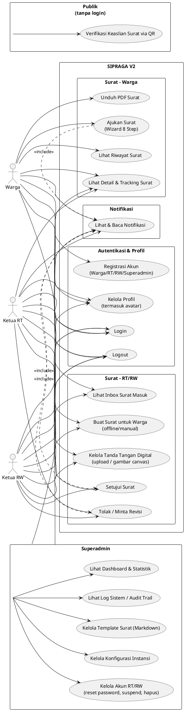

---

## 2. Sequence Diagram — Per Fitur

### 2.1 Login (Warga / RT-RW / Superadmin)

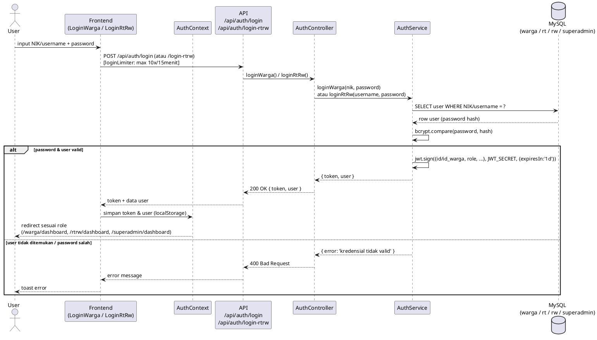

---

### 2.2 Registrasi Warga

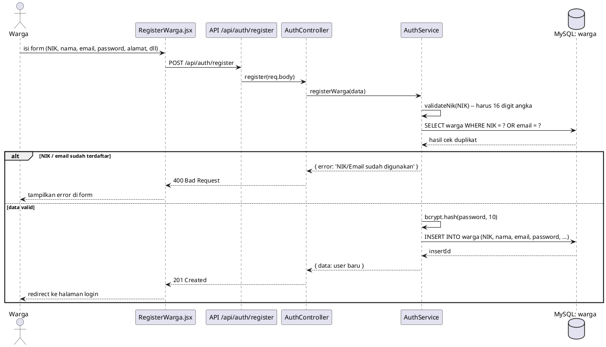

---

### 2.3 Pengajuan Surat — Letter Wizard (Draft → Preview PDF → Submit)

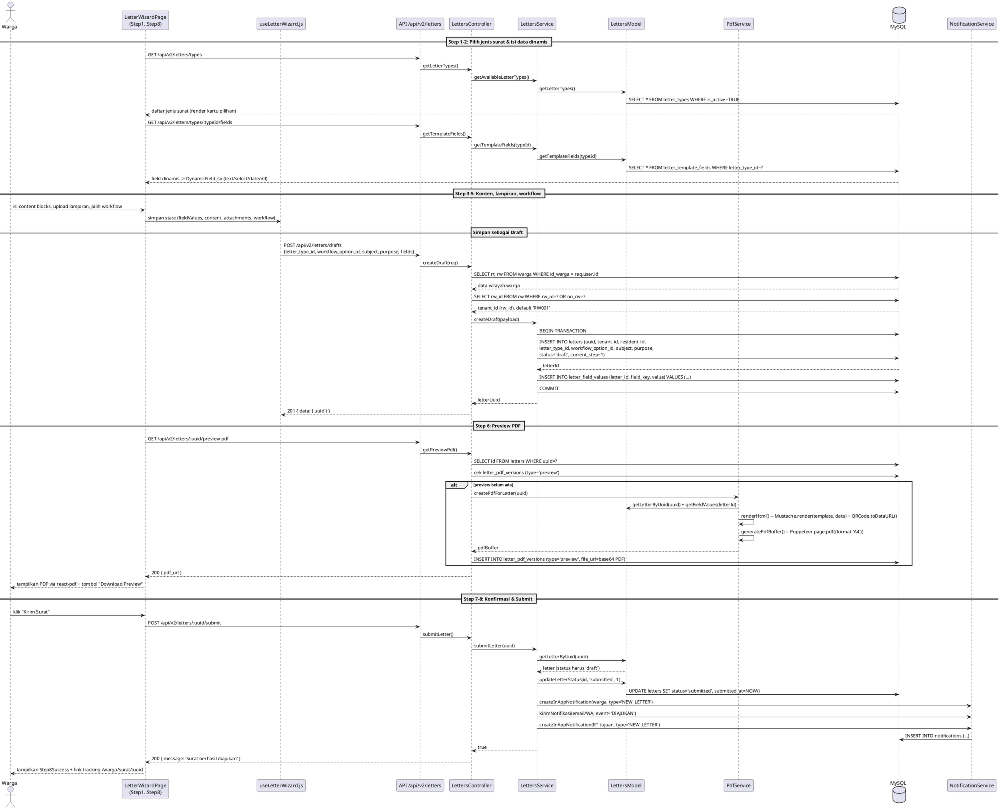

---

### 2.4 RT/RW — Inbox, Approve, Reject (+ generate PDF final)

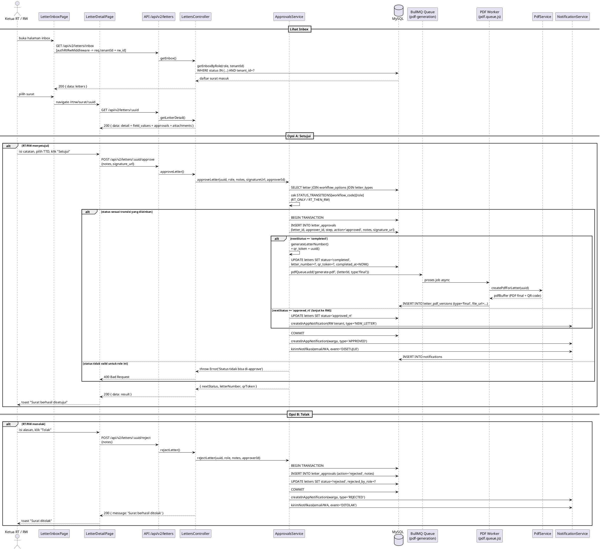

---

### 2.5 Verifikasi Keaslian Surat via QR Code (Publik)

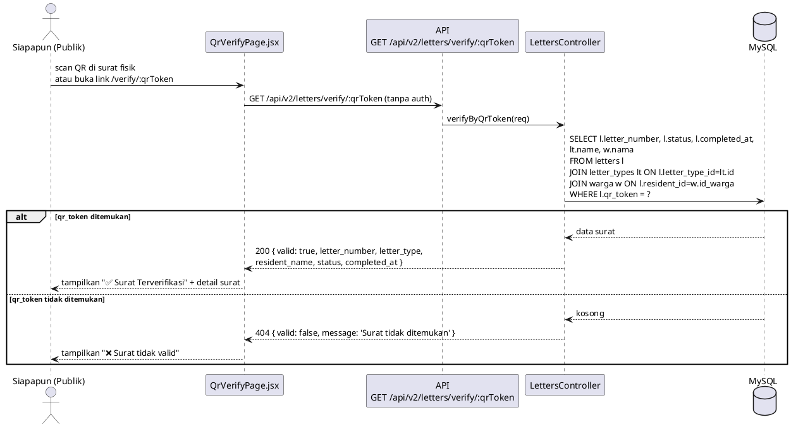

---

### 2.6 Kelola Tanda Tangan Digital (TTD) — Upload File / Gambar Canvas

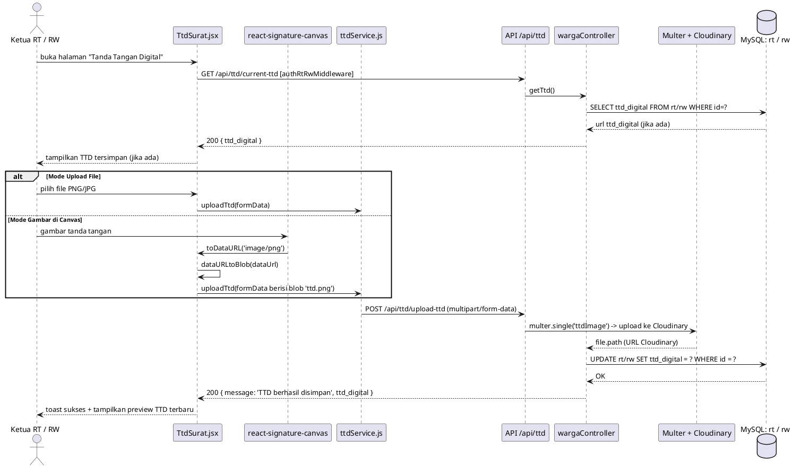

---

### 2.7 Sistem Notifikasi (In-App + Email/WhatsApp)

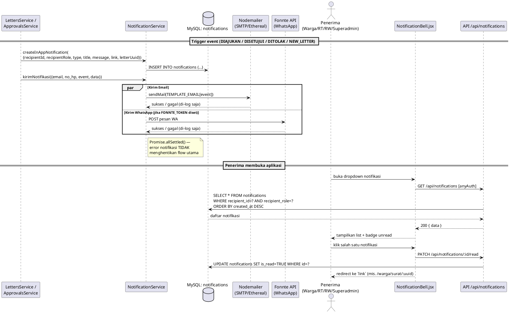

---

### 2.8 Superadmin — Manajemen Akun RT/RW (+ Audit Log)

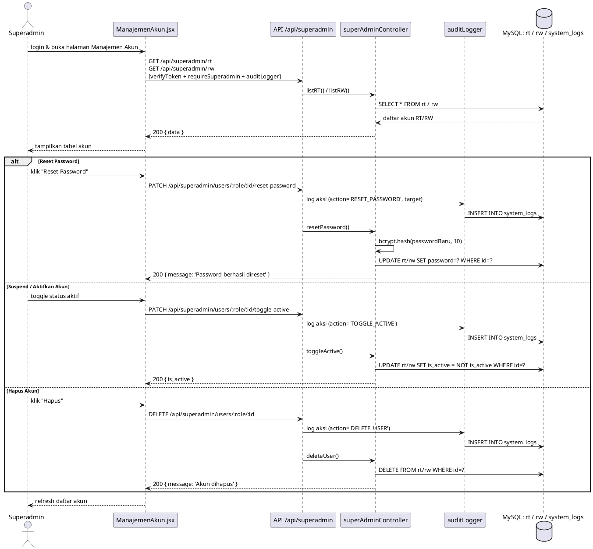

---

## 3. Class Diagram

### 3.1 Domain Model (berdasarkan `database/master.sql`)

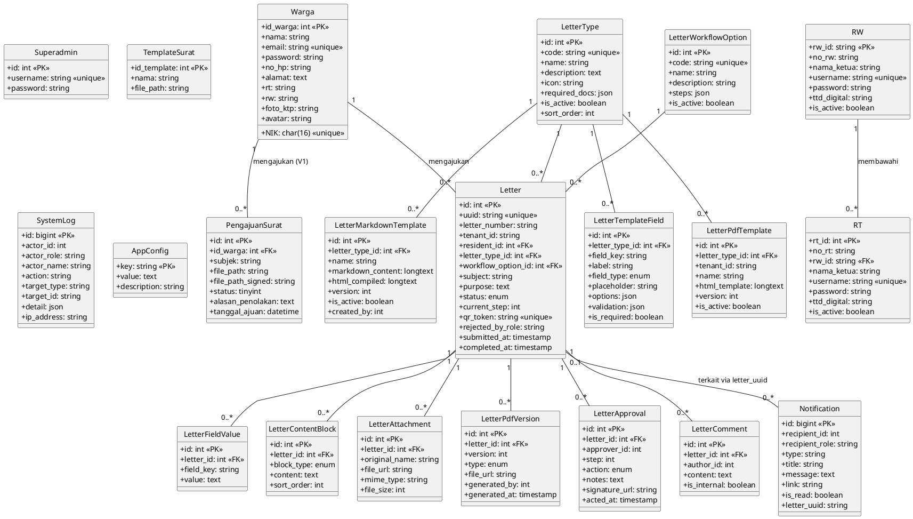

---

### 3.2 Class Diagram — Modul Letters (Backend Service Layer)

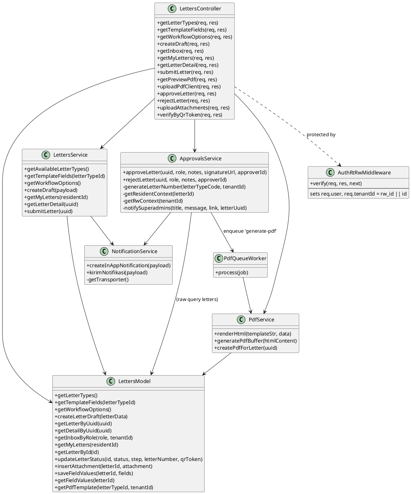
